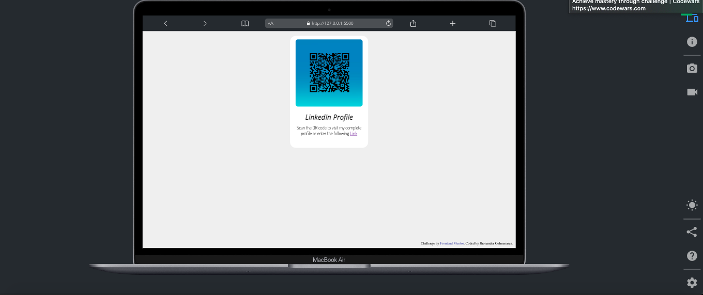
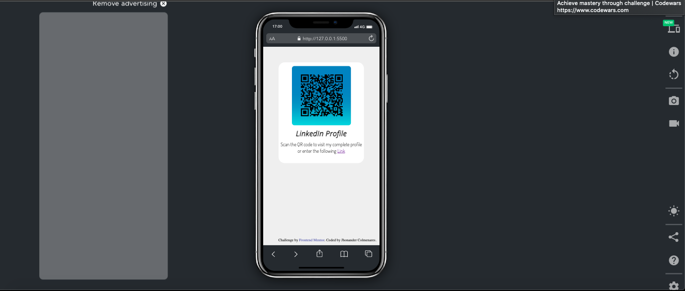

# Frontend Mentor - QR code component solution

This is a solution to the [QR code component challenge on Frontend Mentor](https://www.frontendmentor.io/challenges/qr-code-component-iux_sIO_H). Frontend Mentor challenges help you improve your coding skills by building realistic projects. 

## Table of contents

- [Overview](#overview)
  - [Screenshot](#screenshot)
- [My process](#my-process)
  - [Built with](#built-with)
  - [What I learned](#what-i-learned)
- [Author](#author)

## Descripción general

This is a project that consists of creating a LinkedIn profile using HTML, CSS and Sass. The page consists of a section with a card showing a photo, a QR code and a link to my LinkedIn profile. The card has an elegant style with transition effects and soft shadows. Sass has been used to write the CSS more efficiently.

### Screenshot

## mi proceso

To carry out this project, I started by designing the HTML structure of the page. Then, I added basic CSS styles to give shape and structure to the page. I used Sass as a CSS preprocessor to make writing the code more efficient and modular. Through Sass, I created variables for colors and repetitive measurements.

### Built with

- Figma
- Semantic HTML5 markup
- CSS custom properties
- Flexbox
- CSS Grid
- SASS
- Mobile-first workflow

### What I learned

In the context of my project, I have been developing my skills in using Figma as a wireframe design tool, replacing my previous use of Whimsical. This transition to Figma has provided me with an advantage in terms of design clarity, allowing me to gain a better visualization and understanding of the design process.

## Author

- Frontend Mentor - [@JohnFitzroy](https://www.frontendmentor.io/profile/JohnFitzroy)
- GitHub - [JohnFitzroy](https://github.com/JohnFitzroy)
